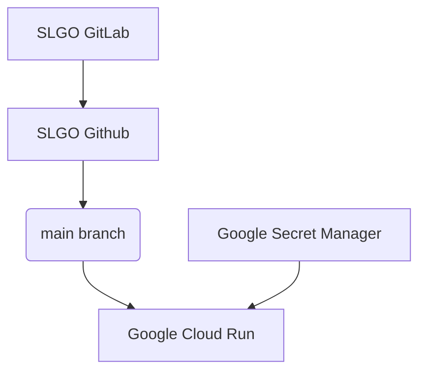

# Observia Backend Metadata API

## Overview

The Observia Backend Metadata API is a FastAPI-based application designed for managing and processing metadata.

## Features

- **REST API** for metadata operations.
- Integration with **LangChain** and **OpenAI** for metadata processing.
- Structured output using **Pydantic** models.
- Ready for containerized deployment using **Docker Compose**.
- Includes development-friendly tools like Poetry for dependency management.

The system is deployed from SLGO's GitLab to Github to a Google Cloud Run service.

## Project Structure

```
observia_backend_metadata/
├── app/
│   ├── api/
│   │   └── v1/
│   │       ├── __init__.py
│   │       ├── endpoints.py
│   ├── core/
│   │   ├── __init__.py
│   │   ├── chain_setup_eov.py
│   │   ├── chain_setup_metadata.py
│   ├── schemas/
│   │   ├── __init__.py
│   │   ├── metadata.py
│   │   ├── eov.py
│   │   ├── feedback.py
│   ├── services/
│   │   ├── __init__.py
│   │   ├── metadata_transform.py
│   ├── utils/
│   │   ├── __init__.py
│   │   ├── helpers.py
├── main.py
├── tests/
│   ├── __init__.py
│   ├── test_api.py
├── Dockerfile.api
├── docker-compose.yml
├── poetry.lock
├── pyproject.toml
└── README.md

```

## Prerequisites

- **Python 3.9 or later**
- **Poetry** for dependency management
- **Docker and Docker Compose** for containerization

## Installation

1. Clone the repository:

   ```bash
   git clone https://github.com/your-repo/observia-backend-metadata.git
   cd observia-backend-metadata
   ```

2. Set up environment variables:

   Create a `.env` file at the root of the project and define the following variables:

   ```env
   OPENAI_API_KEY=your-api-key-here
   ```

## Usage

### Using Docker

1. Build and start the containers:

   ```bash
   docker-compose up --build
   ```

2. Access the API documentation:

   Open [http://localhost:8000/docs](http://localhost:8000/docs) in your browser.

### CI/CD

#### Maintenance
This project is maintained through the [SLGO self-hosted GitLab repository](http://10.0.4.9:1410/sandbox-ogsl/observia_backend_metadata).

#### Mirroring
Changes made to the GitLab repository are automatically mirrored to the [GitHub repository](https://github.com/OGSL-SLGO/observia-backend-metadata/tree/main) using GitLab's repository mirroring feature (see settings -> repository -> Mirroring repositories [here](http://10.0.4.9:1410/sandbox-ogsl/observia_backend_metadata/-/settings/repository)).

Any updates to the GitHub repository `main` branch trigger a redeployment of the container as a service on Google Cloud Run, which can be accessed [here](https://observia-backend-metadata-797895507841.us-central1.run.app).

#### Google Cloud Run
Google Cloud Run ensures that the latest changes are synced to the deployment via a GitHub trigger, which can be managed [here](https://console.cloud.google.com/run?referrer=search&authuser=0&hl=en&project=observia&supportedpurview=project). Environment variables are securely managed using the Google Secret Manager Service, accessible [here](https://console.cloud.google.com/security/secret-manager?referrer=search&authuser=0&hl=en&project=observia&supportedpurview=project).



## Contributing

## License
